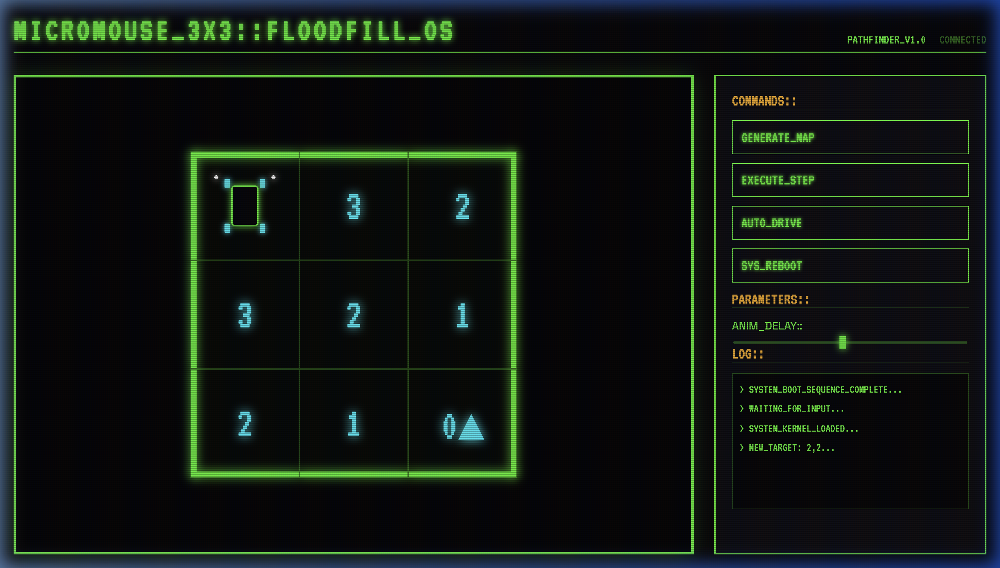
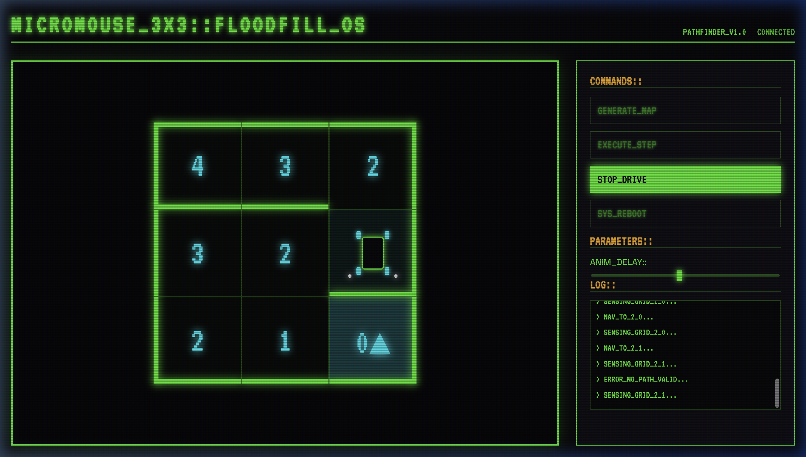

# 🐭 Cyber-Micromouse Simulator: 3x3 Floodfill-OS

A high-fidelity, retro-futuristic simulation of a Micromouse robot car navigating a 3x3 grid using the specialized **Modified Floodfill** algorithm. 



## 🚀 Overview

This project simulates a "Cyber-Car" navigating through a dynamically generated maze. Built with a strict I/O isolation architecture, it decouples algorithmic logic (Pathfinding, Sensing, Decision Making) from the UI (Rendering, Animations).

The robot utilizes a **Sense ➔ Calculate ➔ Move** cycle to navigate from its starting point `(0,0)` to a randomly assigned destination `0▲` while discovering and mapping walls in real-time.

### ✨ Key Features

- **Cyber-Car UI**: Custom-designed CSS-based chassis with neon headlights and glowing wheels.
- **Dynamic Maze Generation**: Generates 3x3 randomized mazes (excluding the center) on every reboot.
- **Floodfill Algorithm**: Real-time recalculation of the distance grid as the robot discovers new barriers.
- **Perimeter Detection**: Solid outer boundaries are always visible, mimicking real-world maze constraints.
- **Retro-Futuristic Aesthetic**: CRT scanline effects, glowing neon green/cyan visuals, and terminal-style logs.
- **Smooth Navigation**: `cubic-bezier` transitions for fluid movement and chassis rotation.

## 🧠 Navigation Logic: How it Thinks

The robot searches for the shortest path using a **Breadth-First Search (Modified Floodfill)** algorithm:

1.  **Sense**: Upon entering a cell, the robot's "sensors" detect neighboring walls and update its internal memory (`knownWalls`).
2.  **Floodfill Calculation**: The robot virtually "floods" its internal map starting from the destination (value `0`), expanding outwards. Walls block this "flood," forcing numbers to route around them.
3.  **Downhill Movement**: The robot looks at its immediate neighbors (N, S, E, W) and chooses the path with the **lowest distance value** to ensure it’s always walking "downhill" toward the goal.
4.  **Bilateral Mapping**: Discovered walls are updated on both sides of a grid boundary to prevent infinite oscillation loops during path recalculations.

## 🎬 Project Demo


## 🛠️ Technology Stack

- **Core**: Vanilla JavaScript (ES6 Modules)
- **Styling**: Vanilla CSS (CSS Grid, Flexbox, Variable-driven design)
- **Structure**: Semantic HTML5
- **Icons**: Custom terminal symbols (`0▲`, `1`, `2`)

## 🏁 Getting Started

1.  Clone the repository:
    ```bash
    git clone https://github.com/draconra/floodfill-robot-simulation.git
    cd floodfill-robot-simulation
    ```
2.  Launch a local server (e.g., using Python):
    ```bash
    python3 -m http.server 8000
    ```
3.  Open `http://localhost:8000` in your browser.

---

### 🎨 Visual State Examples


*Example of a randomized 3x3 maze configuration with perimeter walls and discovered inner walls.*

---
*Created with 💚 for Micromouse enthusiasts and robotics learners.*
